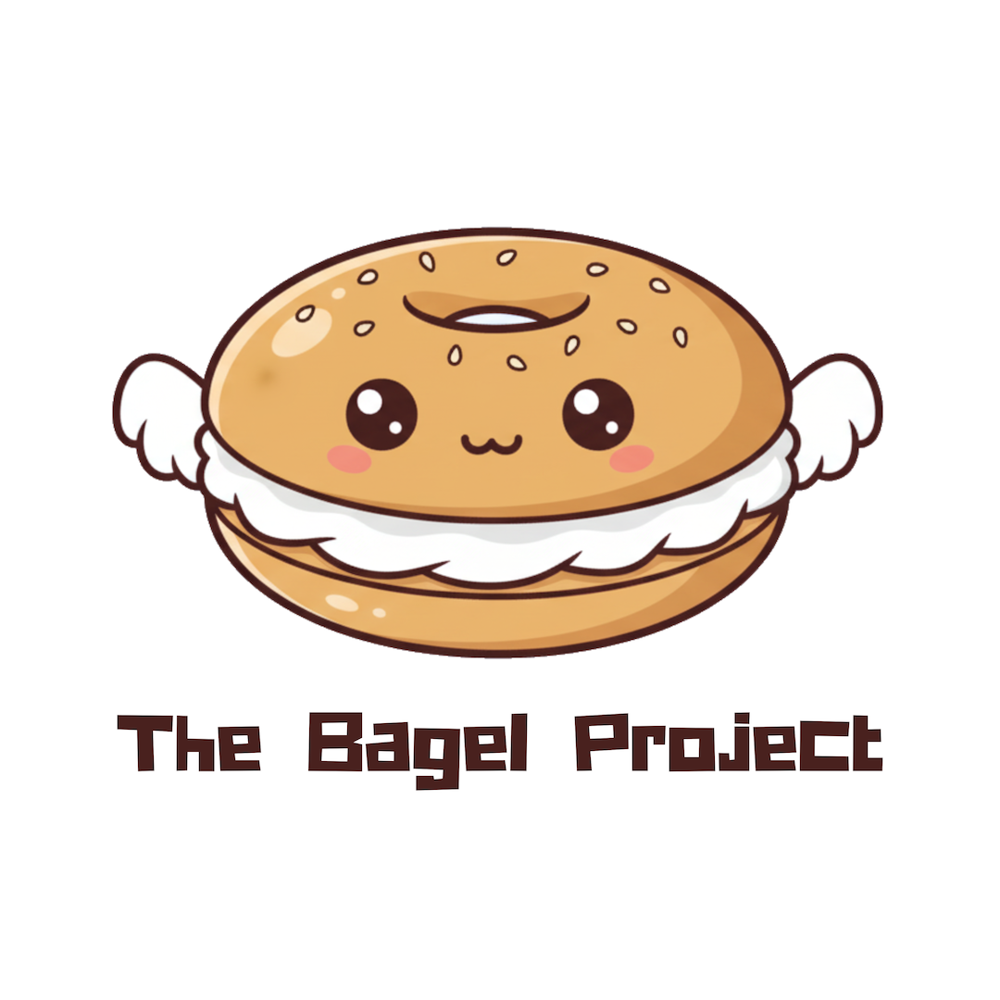
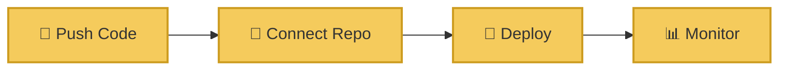
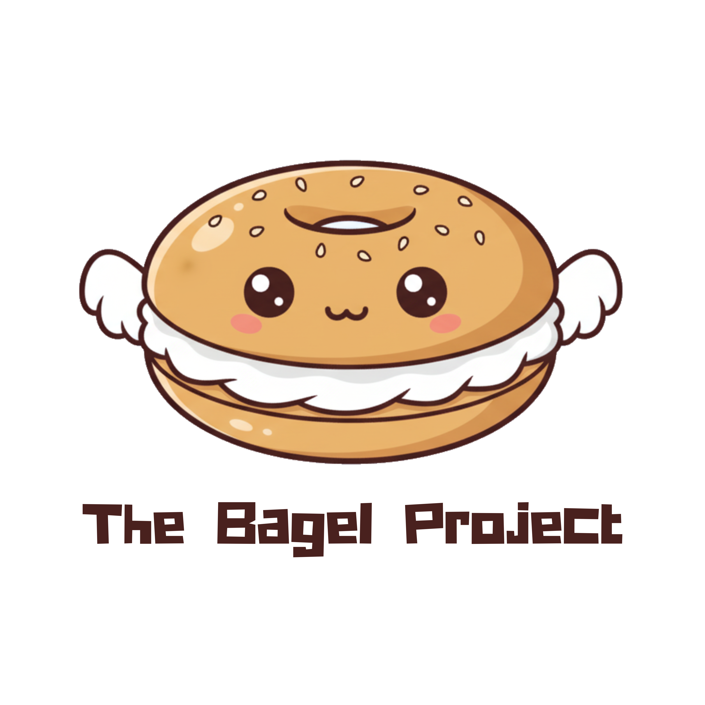
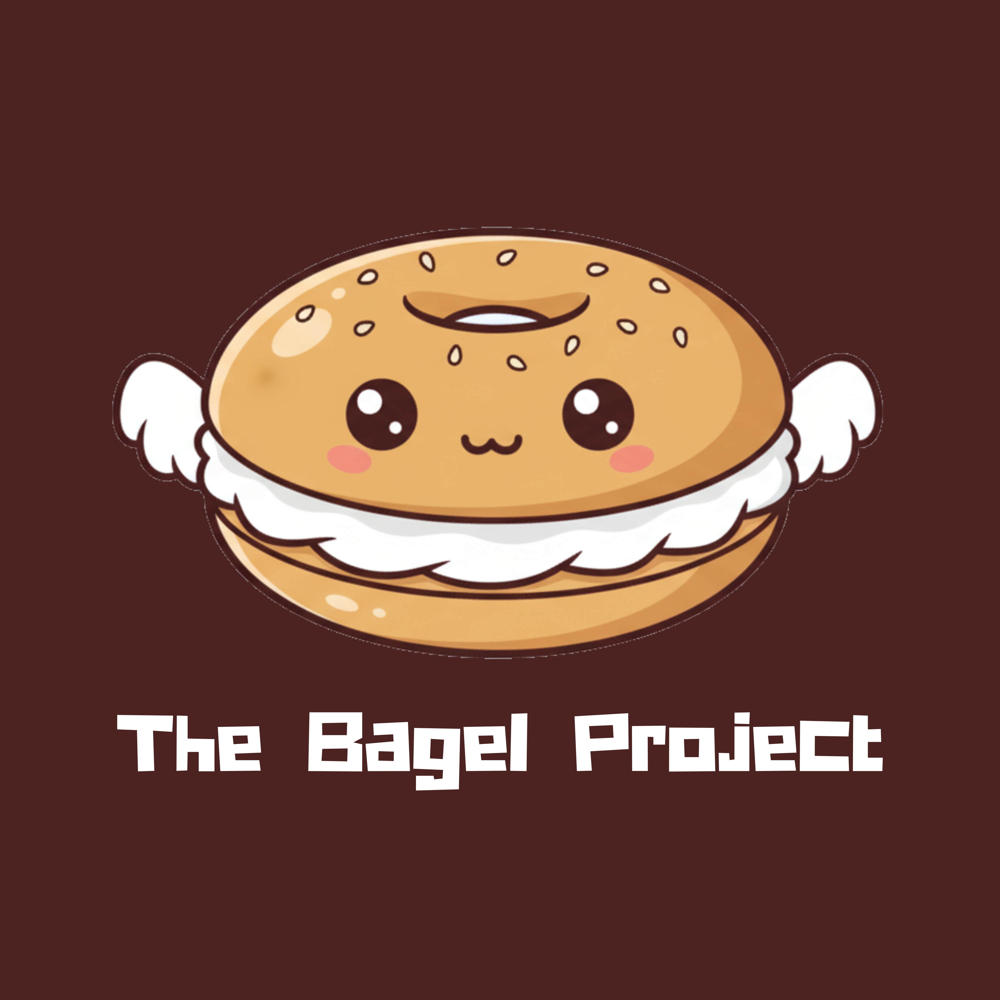

# 🥯 The Bagel Project

<div align="center">
  
  
  ### **Provision Cloud Infrastructure, The Easy Way**
  
  *Making Terraform deployments as simple and delightful as enjoying fresh-baked bread*
  
  [](https://github.com/TheBagelProject)
  [](LICENSE)
  [](https://discord.gg/bagel)
</div>

---

## 🌟 What is The Bagel Project?

The Bagel Project is an **open-source self-service platform** that transforms the way developers deploy cloud infrastructure. Built with the warmth and attention to detail of a European bakery, Bagel makes Terraform deployments as simple and delightful as enjoying fresh-baked bread.

<div align="center">
  
  <p><em>Beautiful, intuitive dashboard that makes infrastructure management effortless</em></p>
</div>

## ✨ Key Features

<table>
<tr>
<td width="50%">

### 🔄 **Self-Service Deployment**
Deploy infrastructure independently with no DevOps bottlenecks. Simple, intuitive, and powerful.

### 🔗 **GitHub Integration** 
Seamlessly connect your repositories and trigger deployments directly from your existing workflow.

### ⚡ **Real-time Monitoring**
Live deployment logs and status tracking to keep you informed every step of the way.

</td>
<td width="50%">

### 🎨 **User-Friendly UI**
Beautiful, artisanal interface that makes complex infrastructure management feel effortless.

### 🐳 **Containerized Execution**
Secure, isolated Terraform runs in containerized environments for reliability and safety.

### 👥 **Open-Source Community**
Built by developers, for developers. Join our growing community of infrastructure enthusiasts.

</td>
</tr>
</table>

## 🚀 How It Works

<div align="center">
  


</div>

| Step | Action | Description |
|------|--------|-------------|
| **1** | 📁 **Push Terraform Code** | Push your Terraform infrastructure code to your GitHub repository |
| **2** | 🔗 **Connect Repository** | Connect your GitHub repo to Bagel's intuitive platform |  
| **3** | 🚀 **Deploy with One Click** | Deploy your infrastructure seamlessly with our user-friendly interface |
| **4** | 📊 **Monitor & Manage** | Track deployments in real-time with comprehensive logging and project management |

<div align="center">
  <em>Four simple steps to get from code to cloud ☁️</em>
</div>

## 🏗️ Supported Platforms

<div align="center">

| Cloud Provider | Status | Features |
|----------------|--------|----------|
| **AWS** ☁️ | ✅ Fully Supported | EC2, S3, RDS, Lambda, VPC, and more |
| **Google Cloud** 🌐 | 🚧 Coming Soon | Compute Engine, Cloud Storage, Kubernetes Engine |
| **Azure** 🔷 | 🚧 Coming Soon | Virtual Machines, Storage Accounts, App Services |
| **Multi-Cloud** 🌍 | 🚧 Coming Soon | Deploy across multiple providers seamlessly |

</div>

## 📊 Community & Project Stats

<div align="center">
  
  | 🌟 Stars | 🍴 Forks | 🚀 Deployments | 👥 Contributors |
  |----------|----------|-----------------|------------------|
  | **2.3k+** | **400+** | **10k+** | **50+** |
  
</div>

## 🍞 Why "Bagel"?

Just like a master baker perfecting their craft, we've carefully designed each feature to make infrastructure deployment a delightful experience. Our philosophy:

<div align="center">
  
> *"Like sharing a recipe that's been in the family for generations, we believe great infrastructure tools should be available to everyone."*
> 
> — The Bagel Team

</div>

<div align="center">
  
  <p><em>Artisanal quality, industrial strength</em></p>
</div>

## 🚀 Getting Started

Ready to start baking your infrastructure? Here's how to get started with Bagel:

### Quick Start
```bash
# Clone the main repository
git clone https://github.com/TheBagelProject/bagel.git

# Navigate to the project
cd bagel

# Follow the setup instructions
npm install && npm start
```

### 📚 Documentation
- 📖 [**Getting Started Guide**](https://docs.bagel.dev/getting-started)
- 🏗️ [**Architecture Overview**](https://docs.bagel.dev/architecture)
- 🔧 [**API Reference**](https://docs.bagel.dev/api)
- 🎯 [**Best Practices**](https://docs.bagel.dev/best-practices)

## 🤝 Contributing

We welcome contributions from developers of all skill levels! Whether you're fixing bugs, adding features, or improving documentation, your help makes Bagel better for everyone.

<div align="center">

[](https://github.com/TheBagelProject/bagel/graphs/contributors)

</div>

### How to Contribute
1. 🍴 Fork the repository
2. 🌿 Create a feature branch
3. 💻 Make your changes
4. 🧪 Add tests if needed
5. 📝 Update documentation
6. 🚀 Submit a pull request

## 🏆 Repositories

<div align="center">

| Repository | Description | Status |
|------------|-------------|---------|
| [**bagel**](https://github.com/TheBagelProject/bagel) | 🥯 Main platform repository |  |
| [**bagel-cli**](https://github.com/TheBagelProject/bagel-cli) | 🛠️ Command line interface |  |
| [**bagel-docs**](https://github.com/TheBagelProject/bagel-docs) | 📚 Documentation site |  |
| [**bagel-examples**](https://github.com/TheBagelProject/bagel-examples) | 📋 Example Terraform configurations |  |

</div>

## 🌐 Connect With Us

<div align="center">
  
  [](https://bagel.dev)
  [](https://docs.bagel.dev)
  [](https://github.com/orgs/TheBagelProject/discussions)
  [](https://twitter.com/BagelProject)
  
</div>

## 📧 Support

Need help? We're here for you!

- 💬 [GitHub Discussions](https://github.com/orgs/TheBagelProject/discussions) - Community Q&A
- 🐛 [Issue Tracker](https://github.com/TheBagelProject/bagel/issues) - Bug reports and feature requests
- 📧 [Email Support](mailto:support@bagel.dev) - Direct support
- 📖 [Documentation](https://docs.bagel.dev) - Comprehensive guides and tutorials

## 📜 License

The Bagel Project is open source software licensed under the [MIT License](LICENSE).

---

<div align="center">
  
  **Built with ❤️ by the open source community**
  
  
  
  *Freshly baked infrastructure, served daily* 🥯
  
  
  [](https://github.com/TheBagelProject)
  
</div>
