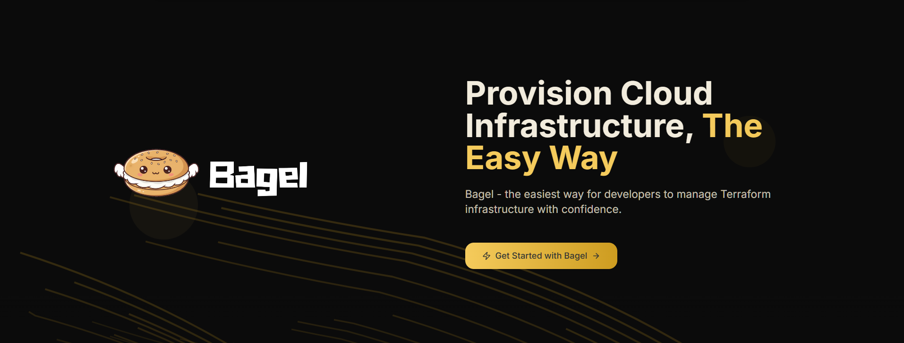

<div align="center">


# 🥯 Bagel

### Open-Source Self-Service Terraform Platform

**The easiest way for developers to manage Terraform infrastructure with confidence**

[](https://www.terraform.io/)
[](LICENSE)
[](https://github.com/TheBagelProject)

[Features](#-key-features) • [Quick Start](#-quick-start) • [Architecture](#-architecture) • [Roadmap](#-roadmap)

</div>

---

## 🌟 What is Bagel?

**Bagel is an open-source, self-service platform that makes Terraform-based infrastructure provisioning simple, fast, and intuitive - built for developers who just want to ship.**

Empower your team to deploy infrastructure seamlessly with minimal dependencies. Simple, intuitive, and powerful.

<div align="center">
  
  <p><em>Intuitive interface designed for developers</em></p>
</div>

### 🎯 Perfect For:
- **Developers** who want to own their infrastructure without the complexity
- **Teams** seeking self-service infrastructure provisioning
- **Startups** transitioning to Infrastructure as Code (IaC)
- **Organizations** looking to reduce infrastructure deployment bottlenecks

---

---

## ✨ Key Features

<table>
<tr>
<td width="50%">

### � **Self-Service Deployments**
Deploy infrastructure with minimal clicks. No manual Terraform commands or waiting on DevOps teams.

### 🔗 **GitHub Integration**
Seamlessly connect your repositories and manage infrastructure code directly from your Git workflows.

</td>
<td width="50%">

### 📊 **Live Deployment Logs**
Track deployment progress and view execution logs in real-time as your infrastructure is provisioned.

### 🌍 **AWS Support**
Full support for AWS infrastructure with multi-cloud support coming soon.

</td>
</tr>
<tr>
<td width="50%">

### 📦 **Project & Space Organization**
Organize your infrastructure into projects and spaces for better management and team collaboration.

### � **Deployment History**
Complete audit trail of all deployments with detailed logs and status tracking.

</td>
<td width="50%">

### 🎨 **Developer-First UI**
Clean, intuitive interface built with Next.js and React - designed for developers by developers.

### ⚡ **Minimal Dependencies**
Get started quickly without complex setup. Just Docker, and you're ready to go.

</td>
</tr>
</table>

---

---

## 🚀 Quick Start

Get Bagel up and running in less than 2 minutes!

### Prerequisites
- [Docker](https://docs.docker.com/get-docker/) (version 20.10+)
- [Docker Compose](https://docs.docker.com/compose/install/) (version 2.0+)
- 4GB RAM minimum
- Internet connection for pulling images

### 🏃 Start Bagel

```bash
# Clone the repository
git clone https://github.com/TheBagelProject/bagel-backend
cd bagel-backend

# Start all services
docker-compose up -d

# Check service status
docker-compose ps
```

That's it! 🎉 Bagel is now running.

### 🌐 Access Your Platform

| Service | URL | Description |
|---------|-----|-------------|
| **UI** | `localhost:3000` | Main web interface |
| **API** | `localhost:5000` | Backend REST API |
| **Database** | `localhost:27017` | MongoDB (internal) |

### � Stop Bagel

```bash
docker-compose down
```

---

---

## 🏗️ Architecture

Bagel consists of four main components running as Docker containers:

```
┌─────────────────────────────────────────────────────────-┐
│                    Bagel Platform                        │
├──────────────┬──────────────┬──────────────┬───────────--┤
│   Frontend   │   Backend    │    Server    │  Database   │
│   (Next.js)  │  (Node.js)   │  (Terraform) │  (MongoDB)  │
│              │              │   + AWS CLI  │             │
│   Port 3000  │   Port 5000  │              │ Port 27017  │
└──────────────┴──────────────┴──────────────┴───────────--┘
```

### Components

- **🎨 [bagel-ui](https://github.com/TheBagelProject/bagel-ui)**: Modern React/Next.js frontend with TypeScript
- **⚙️ [bagel-backend](https://github.com/TheBagelProject/bagel-backend)**: Express.js API server with MongoDB integration
- **🛠️ bagel-server**: Terraform execution environment with AWS CLI
- **💾 mongo-bagel**: MongoDB database for storing configurations and state

---

### Configuration

#### Environment Variables

You can customize Bagel by editing the `docker-compose.yml` file:

```yaml
environment:
  - NODE_ENV=production
  - PORT=5000
  - MONGO_URI=mongodb://mongo-bagel:27017/BagelDB
  # Add your custom configurations here
```

#### Ports

Default ports can be changed in `docker-compose.yml`:
- Frontend: `3000` → `"YOUR_PORT:3000"`
- Backend: `5000` → `"YOUR_PORT:5000"`
- MongoDB: `27017` → `"YOUR_PORT:27017"`

---

## 🔧 Advanced Usage

### View Logs

```bash
# All services
docker-compose logs -f

# Specific service
docker-compose logs -f bagel-backend
docker-compose logs -f bagel-ui
```

### Restart Services

```bash
# Restart all services
docker-compose restart

# Restart specific service
docker-compose restart bagel-backend
```

### Update to Latest Version

```bash
# Pull latest images
docker-compose pull

# Restart with new images
docker-compose up -d
```

---

## 🛠️ Development

Want to contribute or customize Bagel? 

**Development and contribution guidelines coming soon!** 🚀

Stay tuned for:
- Backend development setup guide
- Frontend development guide  
- Contribution guidelines
- Code of conduct

In the meantime, feel free to explore the codebase and [open an issue](https://github.com/TheBagelProject/bagel-backend/issues) with any questions!

---

## 🏆 Repositories

<div align="center">

| Repository | Description | Status |
|------------|-------------|---------|
| [**bagel-ui**](https://github.com/TheBagelProject/bagel-ui) | 🨠Frontend - Modern React/Next.js UI with TypeScript |  |
| [**bagel-backend**](https://github.com/TheBagelProject/bagel-backend) | ⚙️ Backend - Express.js API server with MongoDB integration |  |
| [**sample-terraform-files**](https://github.com/TheBagelProject/sample-terraform-files) | 📋 Sample Terraform configurations for users to test out |  |

</div>

---

### � Community
- **[Discord Community](https://discord.gg/bagel)** - Coming Soon! 🚀
- **[GitHub Discussions](https://github.com/orgs/TheBagelProject/discussions)** - Ask questions and share ideas

### 🐛 Found a Bug?
[Report an issue](https://github.com/TheBagelProject/bagel-backend/issues) and we'll get it fixed!

---

## 🗺️ Roadmap

### ✅ Available Now

<table>
<tr>
<td width="50%">

**🌍 AWS Infrastructure Support**  
Full support for provisioning AWS resources with Terraform

**🔗 GitHub Integration**  
Seamless connection with your GitHub repositories

</td>
<td width="50%">

**📊 Real-time Deployment Logs**  
Live tracking of infrastructure deployment progress

**🚀 Self-Service Project Management**  
Organize and manage infrastructure projects independently

</td>
</tr>
</table>

### 🚀 Coming Soon

<table>
<tr>
<td width="50%">

**💾 Efficient Statefile Management**  
Advanced Terraform state management and versioning

**☁️ Multi-Cloud Support**  
Azure and Google Cloud Platform integration

**⏮️ Deployment Rollback**  
Safely revert infrastructure changes with one click

</td>
<td width="50%">

**🔐 RBAC (Role-Based Access Control)**  
Fine-grained permissions and team access management

**🔌 MCP Servers**  
Model Context Protocol server integration

**🌐 Public APIs**  
RESTful APIs for external integrations and automation

</td>
</tr>
</table>

<div align="center">
  <em>Have a feature request? <a href="https://github.com/TheBagelProject/bagel-backend/issues">Let us know!</a></em>
</div>

---

## 📄 License

Bagel is released under the [AGPL 3.0 License](LICENSE).

---

## 🌐 Official Website

<div align="center">
  <a href="https://thebagelproject.dev">
    
  </a>
  <p><em>Visit our official website at <a href="https://thebagelproject.dev">thebagelproject.dev</a></em></p>
</div>

---

## 🙏 Acknowledgments

Built with ❤️ using:
- [Terraform](https://www.terraform.io/) - Infrastructure as Code
- [Next.js](https://nextjs.org/) - React Framework
- [Express.js](https://expressjs.com/) - Backend Framework
- [MongoDB](https://www.mongodb.com/) - Database
- [Docker](https://www.docker.com/) - Containerization

---

<div align="center">


**⭐ Star us on GitHub - it helps!**

Made with 🥯 by the Bagel Team

[Website](https://thebagelproject.dev) • [GitHub](https://github.com/TheBagelProject)

</div>
